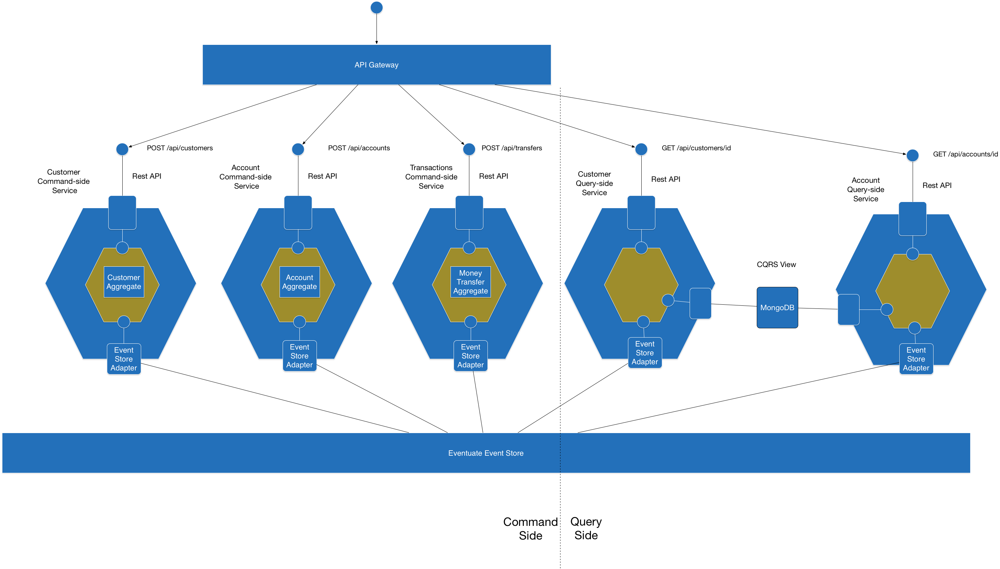

# event-sourcing-sample

This project is an example for microservices with event sourcing and CQRS.

> Technology stack:
> - Node.JS
> - Docker (docker-compose)

## CQRS

There are the following  services:

* Customers Service - REST API for creating customers
* Accounts Service - REST API for creating accounts
* Transactions Service - REST API for transferring money
* Customers View Service  - subscribes to events and updates a MongoDB View, and provides an API for retrieving customers
* Accounts View Service - subscribes to events and updates a MongoDB View, and provides an API for retrieving accounts

There is also an [API gateway](http://microservices.io/patterns/apigateway.html) service that acts as a Facade in front of the services.

## Links
- https://github.com/adrai/cqrs-sample
- https://github.com/cer/event-sourcing-examples
- https://github.com/jamuhl/nodeCQRS
- https://blog.risingstack.com/event-sourcing-with-examples-node-js-at-scale/
- https://github.com/smariussorin/EventSourcedMicroservices
- https://medium.com/technology-learning/event-sourcing-and-cqrs-a-look-at-kafka-e0c1b90d17d8
- https://github.com/adrai/node-cqrs-domain
